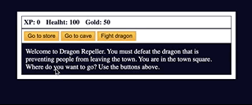

# DRAGON REPELLER GAME APP

The application was built as a practice project for a JavaScript Algorithms and Data Structure course with FreecodeCamp. It features an RPG where players can fight beasts, buy weapons, and a hidden feature. It was built with HTML, CSS, and JavaScript to practice with arrays, strings, objects, functions, loops, and if/else statements.

## Features

- A main screen/town square with three buttons where players can choose which action to take;
- A store where players can buy health or weapons;
- A cave where players can fight beasts and gain experience points and or gold (or lose them);
- A fight dragon button where players can fight the main villain of the game. You can do it!

## Technologies

- HTML
- CSS
- JavaScript

## Start the App

In the project directory, you can run it with the Live Server by right-clicking on index.html.

It will run the app in development mode.\
Open [http://127.0.0.1:5500](http://127.0.0.1:5500/index.html) to view it in your browser.

When making changes, make sure you reload to see it on the page.

### Author

[Tanimara Elias Santos](https://github.com/tanimaraeliassantos)

### Version

1.0.0
